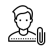
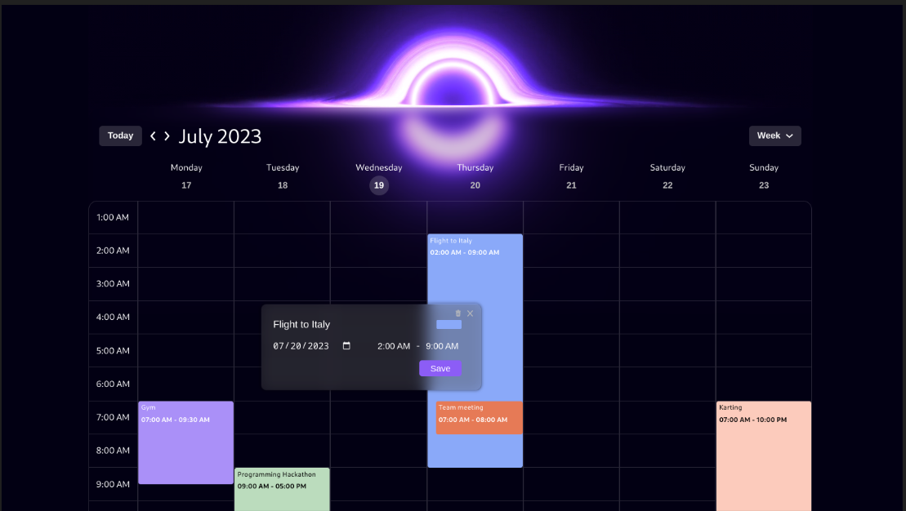
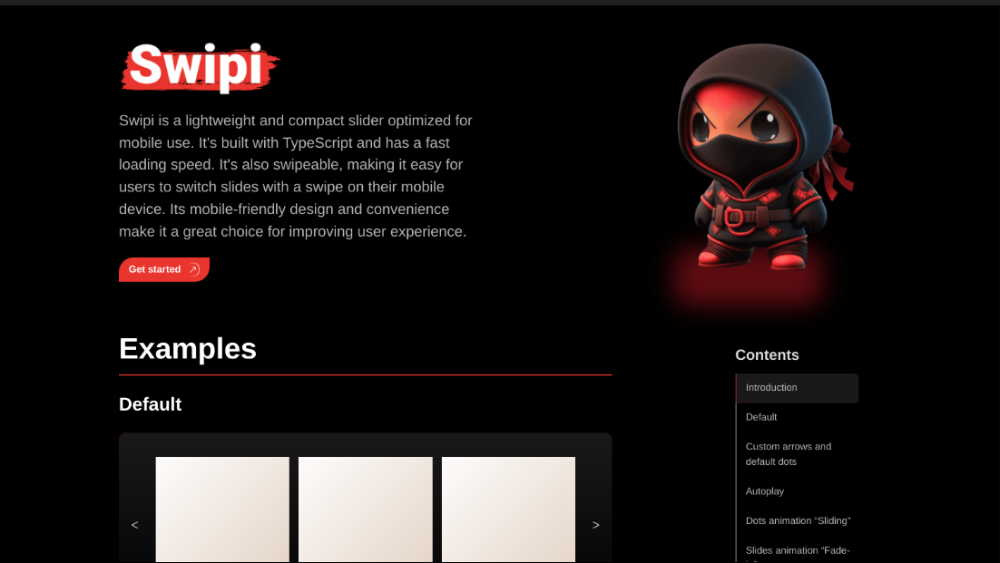
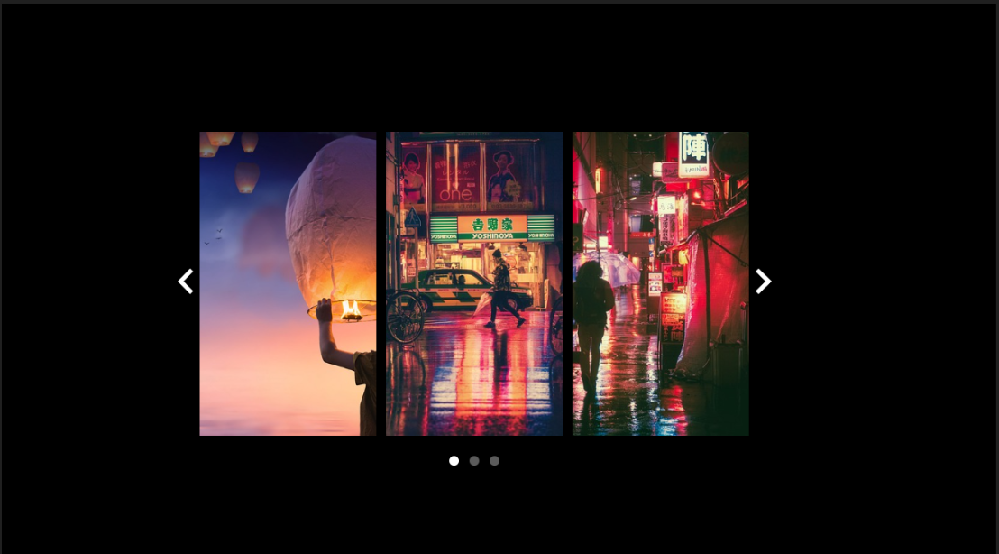
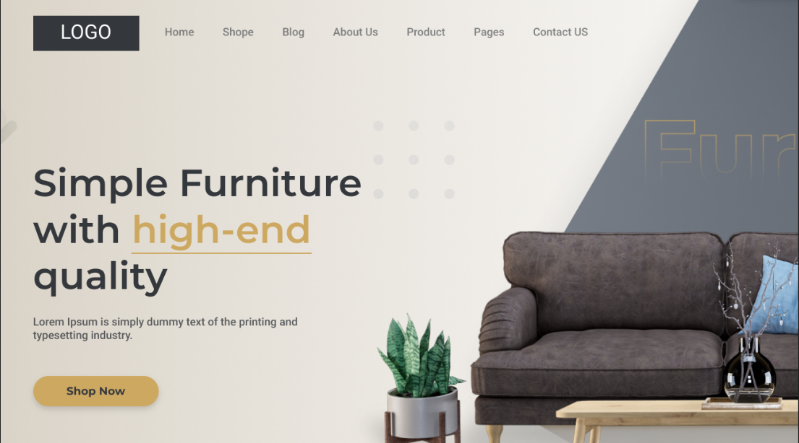
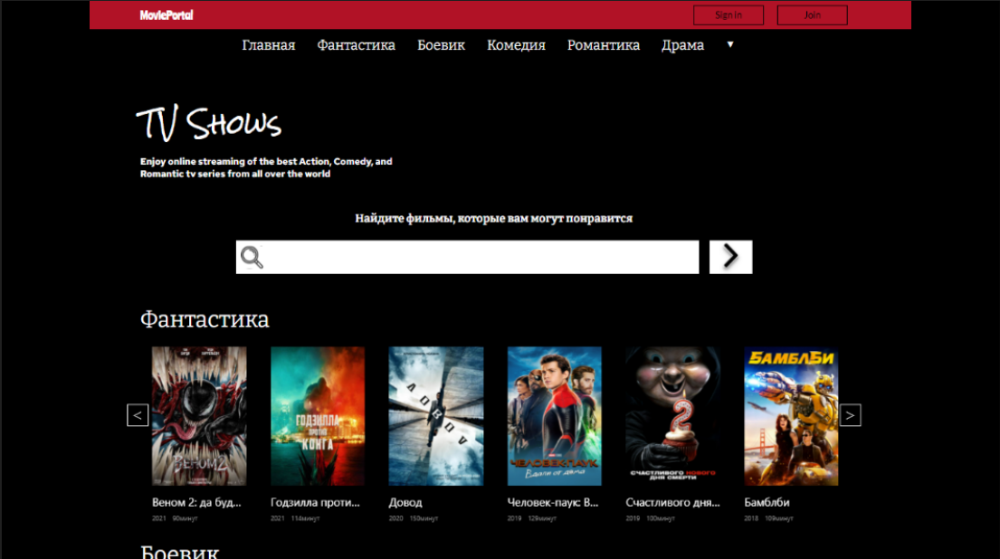
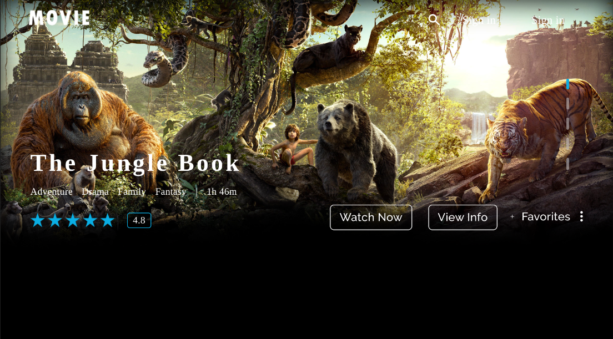
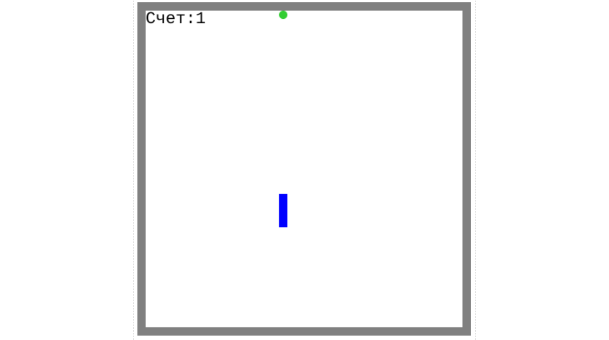

 
  <h1>Resume</h1> 
  

 
    <h1 align="center">Articles</h1>
    <h2 align="center">Medium</h2>
    

 

<h1 align="center">Projects</h1>

<table>
<tr>
  <td>
    <h2 align='center'>Spotify</h2>
      
  
        
         
         
        

           
            
        

        
<strong><i>Technologies: </i> React Native </strong>

      

    </td>
</tr>
<tr style="display: flex;">
    <td width='50%'>
      <h2 align='center'>Training Club</h2>
      
  
        
         
         
        

          
            
        

        
<strong><i>Frontend: </i> TypeScript, React, Material UI, React Query, React Hook Form </strong>

        
<strong><i>Backend: </i> Node.js, Express, Mongodb, Mongoose, TypeScript, Firebase, AWS </strong>

      

    </td>
    <td  width='50%'>
      <h2 align='center'>CHRONOUS</h2>
      
  
        
         
         
        

          
          
           
        

        
<strong><i>Frontend: </i>React, TypeScript</strong>

      

         
         
           
    </td>
  </tr>
  <tr style="display: flex;">
   <td  width='50%'>
      <h2 align='center'>Swipi landing</h2>
      
  
        
         
         
        

          
            
        

        
<strong><i>Frontend: </i>React, TypeScript, Next JS, Chakra UI, Styled System</strong>

      

    </td>
      <td  width='50%'>
      <h2 align='center'>SWIPI</h2>
      

        
         
         
        

          
          
            
        

        
<strong><i>Frontend: </i>React, TypeScript</strong>

      

    </td>

  </tr>
  <tr style="display: flex;">
    <td width='50%'>
      <h2 align='center'>Furniture Shop</h2>
      
  
        
         
         
        

         
          
            
        

        
<strong><i>Frontend: </i> TypeScript, React, Ant Design, Redux Toolkit, Formik, SCSS </strong>

      

       
       
       
    </td>
       <td width='50%'>
      <h2 align='center'>Movie-Portal</h2>
      
  
        
         
         
        

          
            
        

        
<strong><i>Frontend: </i> TypeScript, React, SCSS, Axios, Formik, Redux, Ant Design </strong>

        
<strong><i>Backend: </i> Node.js, Express, Mongodb, Mongoose, TypeScript, AWS </strong>

      

    </td>
  </tr>
  <tr style="display: flex;">
    <td width='50%'>
      <h2 align='center'>School</h2>
      
  
        
         
         
        

          
          
            
        

        
<strong><i>Frontend: </i> HTML, CSS, JavaScript, jQuery </strong>

      

    </td>
   <td  width='50%'>
      <h2 align='center'>Movie Films</h2>
      
  
        
         
         
        

          
          
            
        

        
<strong><i>Frontend: </i>HTML, CSS, JavaScript, jQuery</strong>

      

    </td>
  </tr>
  <tr style="display: flex;">
    <td width='50%'>
      <h2 align='center'>Games</h2>
      
  
        
         
         
        

          
          
            
        

        
<strong><i>Frontend: </i> HTML, CSS, JavaScript, jQuery </strong>

      

    </td>
   <td  width='50%'>
      <h2 align='center'>Snake Game</h2>
      
  
        
         
         
        

          
          
            
        

        
<strong><i>Frontend: </i>HTML, CSS, JavaScript, Canvas</strong>

      

    </td>
  </tr>
</table>
